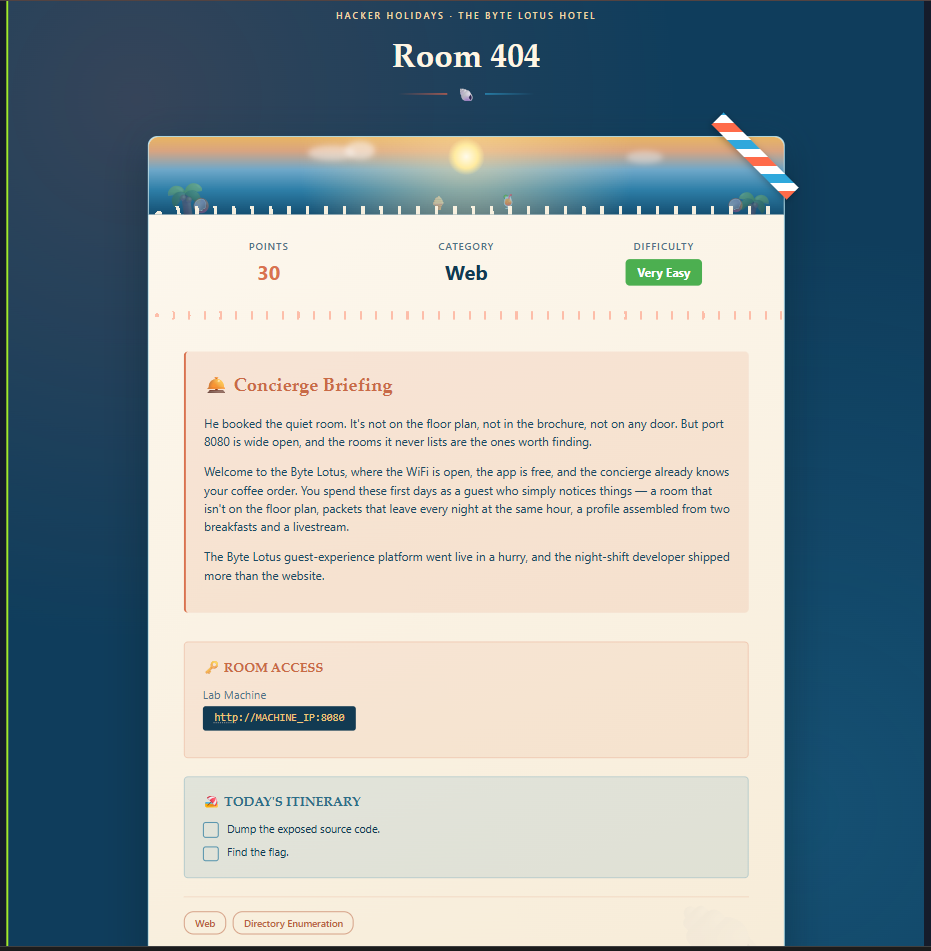
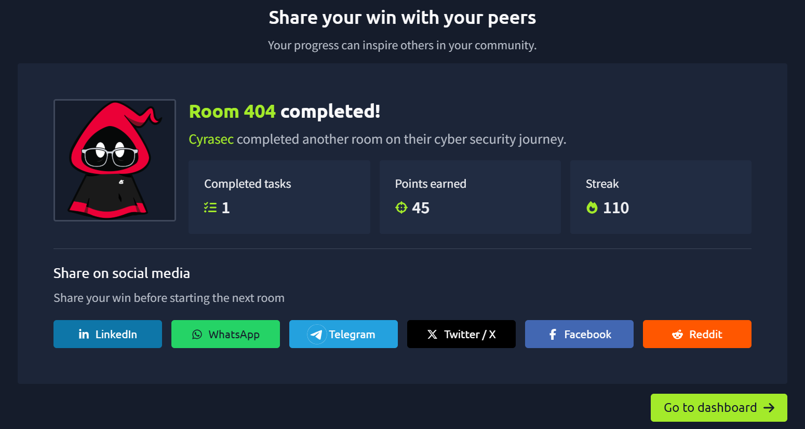
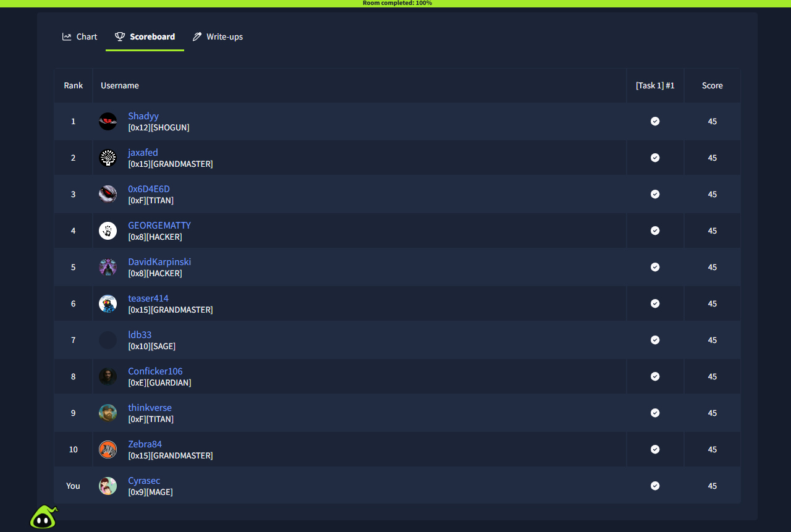

# 🌐 Day 02 – Room 404

## 📌 Overview

This web security challenge focused on discovering hidden application resources and understanding how exposed development artifacts can unintentionally reveal sensitive information.

The room demonstrates why proper deployment practices and directory enumeration are essential during web application security assessments.

---

## 🎯 Objectives

- Explore the exposed web application.
- Practice directory enumeration.
- Analyze exposed resources safely.
- Retrieve the challenge objective without revealing active spoilers.

---

## 🛠 Skills Practiced

- Web Security
- Directory Enumeration
- HTTP Analysis
- Source Code Inspection
- Reconnaissance

---

## 📸 Screenshots

### Challenge Overview

---

### Completion

---

### Scoreboard

---

## 📚 Key Learnings

- Hidden directories can expose sensitive application resources.
- Developers should never deploy staging or debug content to production.
- Directory enumeration is one of the first steps during web application testing.
- Reviewing exposed resources can reveal security weaknesses.
- Small configuration mistakes may lead to significant information disclosure.

---

## 🏷 Tags

`Web Security`
`Directory Enumeration`
`Reconnaissance`
`HTTP`
`TryHackMe`
`Hacker Holidays`

---

> **Note**
>
> This write-up documents my learning experience while intentionally avoiding active challenge solutions, hidden paths, or flags.
