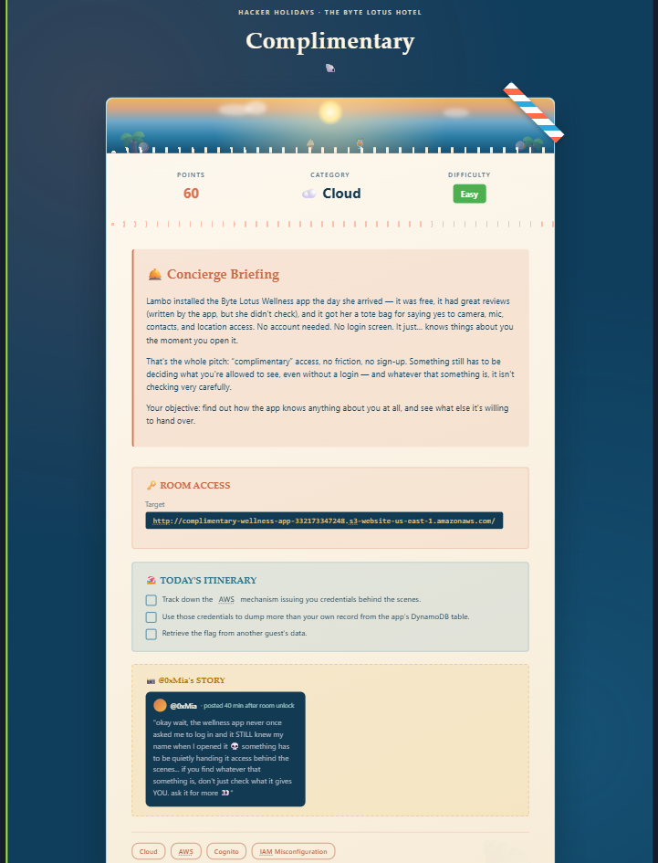
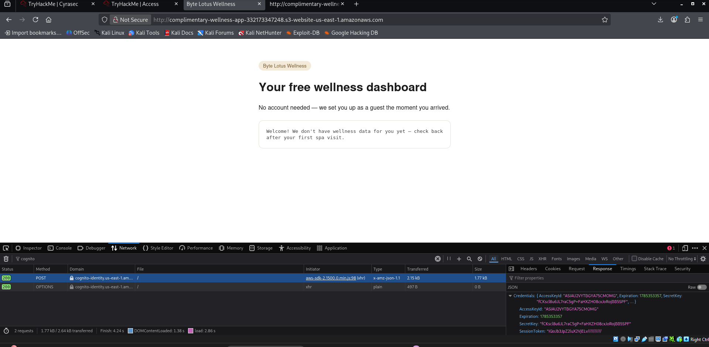
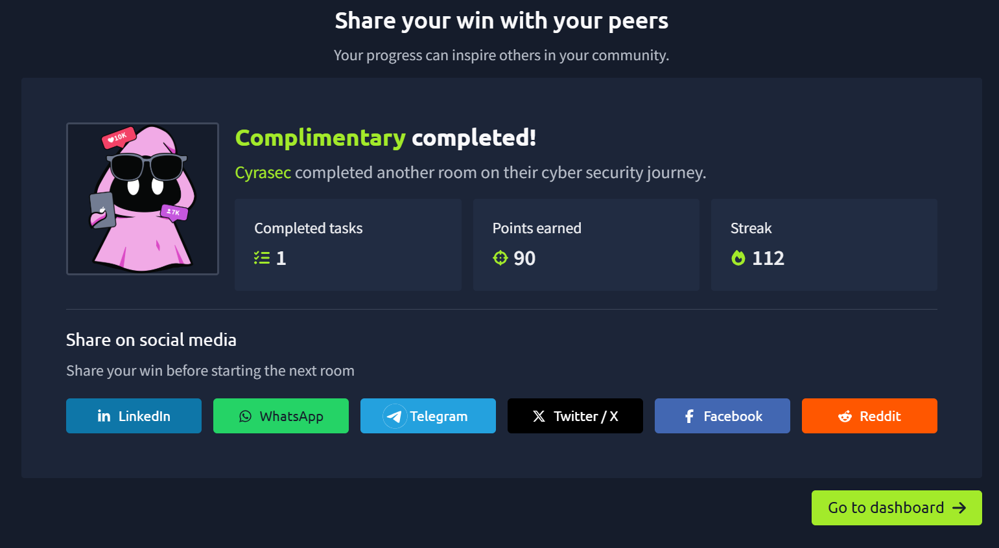

# ☁️ Day 03 – Complimentary

## 📌 Overview

This cloud security challenge demonstrates how misconfigured cloud identity services can unintentionally expose temporary credentials. The room focuses on understanding authentication flows, cloud identity management, and the risks associated with improperly configured cloud resources.

---

## 🎯 Objectives

- Explore the cloud-based application.
- Understand AWS identity and authentication mechanisms.
- Analyze temporary cloud credentials.
- Learn how cloud misconfigurations can expose sensitive resources.
- Complete the challenge while avoiding active spoilers.

---

## 🛠 Skills Practiced

- Cloud Security
- AWS Cognito
- IAM Fundamentals
- Temporary Credentials
- Identity Management
- Cloud Misconfiguration Analysis

---

## 📸 Screenshots

### Challenge Overview

---

### Target Application

---

### Challenge Completion

---

### White Raffle Ticket

---

## 📚 Key Learnings

- Cloud applications often rely on temporary credentials instead of long-term access keys.
- Identity providers play a critical role in cloud authentication.
- IAM permissions should follow the principle of least privilege.
- Misconfigured cloud services may unintentionally expose sensitive resources.
- Browser Developer Tools are useful for inspecting client-side authentication flows.

---

## 🏷 Tags

`Cloud Security`
`AWS`
`AWS Cognito`
`IAM`
`Temporary Credentials`
`Developer Tools`
`TryHackMe`
`Hacker Holidays`

---

> **Note**
>
> This repository documents my learning journey while intentionally avoiding publishing active challenge solutions, flags, credentials, or exploitation steps.
