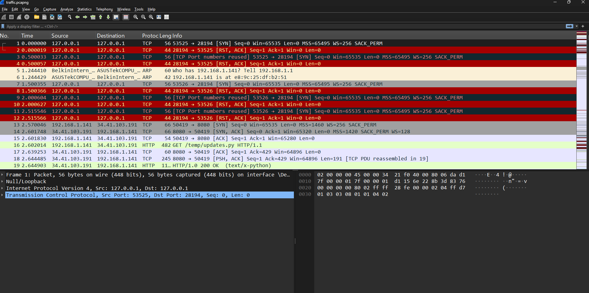
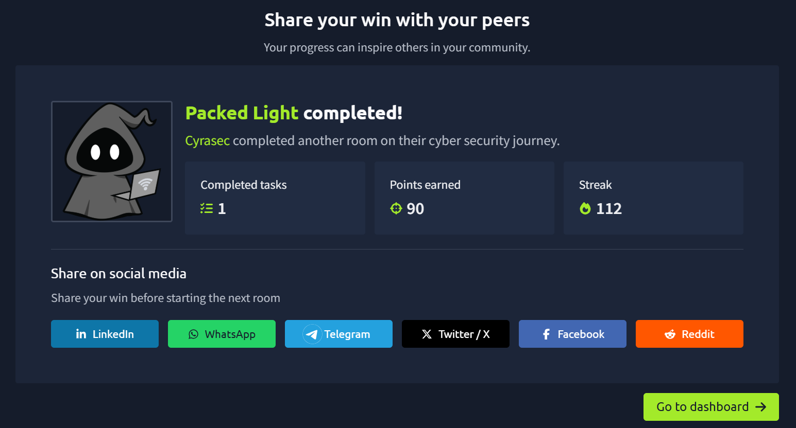

# 📦 Day 04 – Packed Light

## 📌 Overview

This digital forensics challenge focuses on analyzing captured network traffic to identify suspicious communication hidden inside seemingly normal packets. The investigation demonstrates how attackers can conceal data within legitimate network activity and why packet analysis is an essential blue-team skill.

---

## 🎯 Objectives

- Analyze the provided PCAP capture.
- Identify suspicious network traffic.
- Investigate hidden communication.
- Understand basic packet analysis techniques.
- Complete the challenge without revealing active solutions.

---

## 🛠 Skills Practiced

- Digital Forensics
- Network Forensics
- PCAP Analysis
- Wireshark
- HTTP Traffic Inspection
- Basic Cryptography

---

## 📸 Screenshots

### Challenge Overview

---

### Packet Analysis

---

### Challenge Completion

---

## 📚 Key Learnings

- Wireshark can reveal hidden activity within normal-looking traffic.
- Repeated network requests may indicate covert communication.
- HTTP requests and responses often contain valuable forensic artifacts.
- Packet captures help investigators reconstruct attacker behavior.
- Network forensics is an important skill for SOC analysts and incident responders.

---

## 🏷 Tags

`Digital Forensics`
`Network Forensics`
`Wireshark`
`PCAP`
`HTTP`
`Traffic Analysis`
`TryHackMe`
`Hacker Holidays`

---

> **Note**
>
> This repository documents my learning journey while intentionally avoiding publishing active challenge solutions, flags, recovered data, or exploitation steps.
