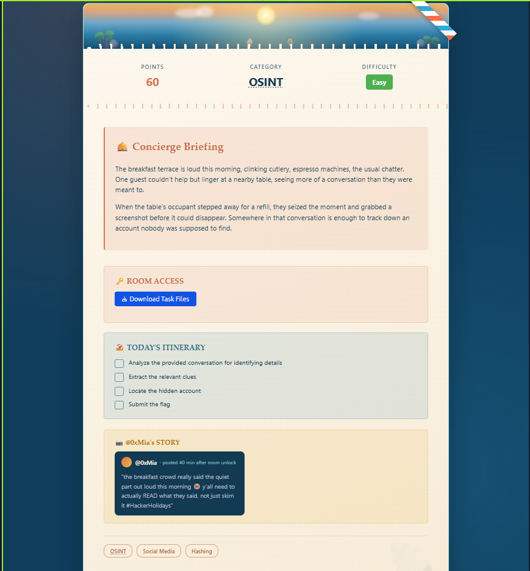
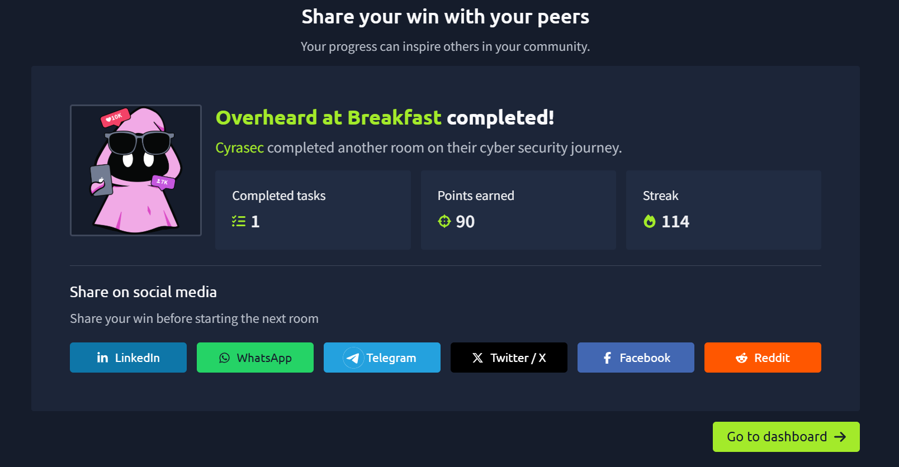

# Overheard at Breakfast — OSINT Writeup

**Category:** OSINT
**Difficulty:** Easy
**Points:** 60

## Challenge Description

> The breakfast terrace is loud this morning, clinking cutlery, espresso machines, the usual chatter. One guest couldn't help but linger at a nearby table, seeing more of a conversation than they were meant to.
>
> When the table's occupant stepped away for a refill, they seized the moment and grabbed a screenshot before it could disappear. Somewhere in that conversation is enough to track down an account nobody was supposed to find.

**Objective:** Analyze a leaked conversation, extract identifying details, locate a hidden account, and submit the flag.



---

## Step 1 — Analyze the Conversation

The provided screenshot shows a chat between two users, **Ponzi** and **Lambo!**, discussing the Byte Lotus resort. Key lines from Lambo:

> "Though I'm still out there, I used to use this free tool that let me upload my profile and link other media accounts — was neat, until I wiped everything. Started with a `G` if I remember correctly."
>
> "But if anything this is my best way of communication: `lambobytelotushotel@gmail.com`"

Two details stand out:
- A free profile/link-in-bio tool starting with **G**
- An email address, which at first looks like a decoy (Ponzi even reacts "seems very secretive!")

## Step 2 — Identify the Tool

A free tool that lets you **upload a profile picture and link your other social media accounts**, starting with **G** → **[Gravatar](https://gravatar.com)**.

Gravatar is unique in that it isn't tied to a username you have to guess — it's looked up by **hashing an email address**. This reframes the email from "red herring" to "the actual key."

## Step 3 — Hash the Email

Gravatar profiles are queried using an MD5 (or SHA256) hash of the lowercased, trimmed email address.

Using CyberChef (`To Lower case` → `MD5`):

```
Input:  lambobytelotushotel@gmail.com
MD5:    d4a5fc5d3128890778667e24617d7cc0
```

## Step 4 — Query the Gravatar API

Gravatar exposes a public JSON endpoint for any hash:

```
https://gravatar.com/d4a5fc5d3128890778667e24617d7cc0.json
```

Response:

```json
{
  "entry": [
    {
      "hash": "d4a5fc5d3128890778667e24617d7cc0",
      "displayName": "Lambo",
      "pronunciation": "Lam-boh",
      "aboutMe": "Funny thing about email hashes, they follow you places you didn't expect. Glad you found the right corner of the internet! Here is your prize: <REDACTED_BASE64>",
      "currentLocation": "Byte Lotus Hotel"
    }
  ]
}
```

Confirmed match — `displayName: Lambo` and `currentLocation: Byte Lotus Hotel`.

## Step 5 — Decode the Flag

The `aboutMe` field contains a base64-encoded string:

```
<REDACTED_BASE64>
```

Decoding with CyberChef (`From Base64`) or:

```bash
echo "<REDACTED_BASE64>" | base64 -d
```

Output:

```
THM{REDACTED}
```

*(Flag redacted per TryHackMe's writeup guidelines — follow the steps above to get your own.)*

---

## Flag

Redacted — follow the steps above in your own room to retrieve it.

## Completion



Room completed — **90 points** earned.

## Key Takeaways

- Don't dismiss oddly-placed details (like an email) as decoys just because a character in the story reacts to them that way — verify independently.
- Gravatar profiles persist even after someone "wipes" their social media, because they're tied to an email hash, not a platform account.
- Any email can be turned into a Gravatar lookup: `md5(lowercase(email))` → `gravatar.com/<hash>.json`.
- Always check profile fields (bio/about) for encoded data (base64 is extremely common in CTFs).
