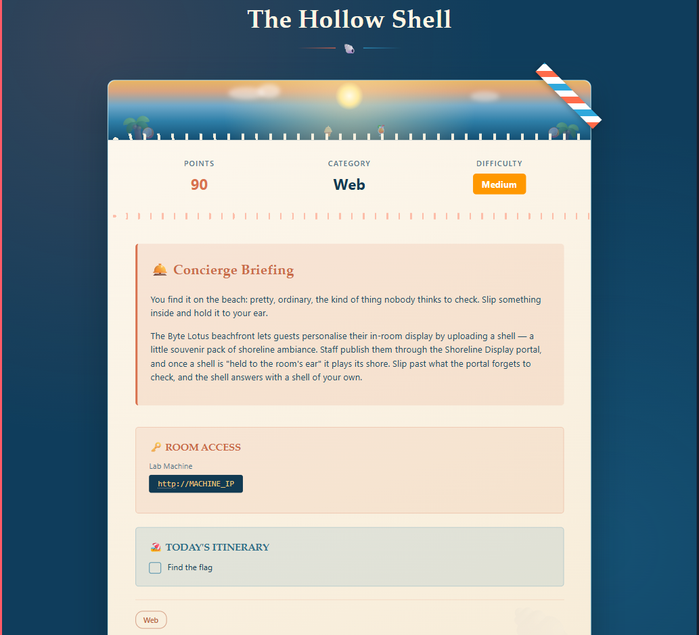
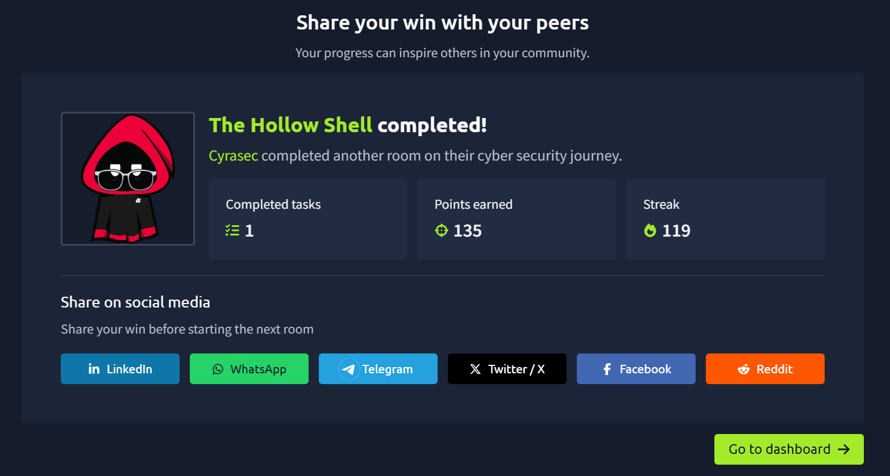

# 🐚 Day 10 — The Hollow Shell (Web)

> **TryHackMe | Web | Medium**

---

## 🏁 Completion

| Information | Details |
|---|---|
| 🏴 Room | The Hollow Shell |
| 🌐 Category | Web |
| 📊 Difficulty | Medium |
| ✅ Status | Completed |

---


---

## 📌 Room Overview

**The Hollow Shell** is a TryHackMe Web Security room focused on insecure file upload functionality and how an application processes uploaded ZIP-based shell packages.

The challenge revolves around the **Byte Lotus** hotel application, where users can upload a `.zip` shell package containing a `shell.json` manifest and optional assets.

---

## 🎯 Objectives

- Analyze a web application's file upload functionality
- Understand ZIP-based application packages
- Inspect and validate a `shell.json` manifest
- Investigate how uploaded files are extracted and processed
- Identify weaknesses in server-side processing
- Retrieve the challenge flag

---

## 🛠️ Tools Used

- 🌐 Firefox
- 🕵️ Burp Suite
- 🔎 Nmap
- 📂 Gobuster
- 🐚 Linux Terminal
- 🔧 cURL

---

## 🔍 Reconnaissance

The target application was running on:

```text
http://MACHINE_IP:5000
```

### Nmap

```bash
nmap -sC -sV -Pn MACHINE_IP
```

### Directory Enumeration

```bash
gobuster dir -u http://MACHINE_IP:5000 -w /usr/share/wordlists/dirb/common.txt
```

Interesting endpoints discovered:

```text
/login
/dashboard
/upload
```

The `/upload` endpoint handles the shell upload functionality.

---

## 📦 Shell Upload

The application expects a ZIP archive containing a `shell.json` manifest.

### Initial Structure

```text
shell.zip
└── shell/
    └── shell.json
```

This structure was rejected because the application expected `shell.json` at the **root of the archive**.

### Correct Structure

```text
shell.zip
└── shell.json
```

A minimal manifest was then created:

```json
{
  "name": "test"
}
```

The resulting ZIP package was successfully accepted by the application.

---

## 🧩 Important Discovery

The application revealed that uploaded shells are extracted into a directory similar to:

```text
shells/<unique-id>/
```

The uploaded `shell.json` could also be accessed through the extracted shell directory.

Another important clue was the application's reference to:

> **automation hooks**

This indicated that uploaded shell packages were processed by a background worker rather than simply being stored as static files.

---

## 🧠 Key Security Concepts

### 1. Untrusted File Uploads

Allowing users to upload archives introduces risks when the server automatically extracts and processes their contents.

### 2. Archive Extraction

ZIP archives should be carefully validated before extraction.

Potential risks include:

- Path traversal
- Unexpected files
- Malicious archive contents
- Unsafe file paths
- Overwriting existing files

### 3. Manifest Processing

Structured files such as JSON manifests should be strictly validated against an expected schema.

### 4. Background Processing

The application mentioned a worker responsible for processing uploaded shells.

Vulnerabilities can exist not only in the upload endpoint but also in the **post-upload processing logic**.

---

## 📝 Methodology

```text
Reconnaissance
      ↓
Identify Web Application
      ↓
Enumerate Endpoints
      ↓
Inspect Upload Functionality
      ↓
Understand ZIP Structure
      ↓
Analyze shell.json
      ↓
Investigate Server-Side Processing
      ↓
Analyze the Vulnerability
      ↓
Retrieve Flag
```

---

## 💡 Lessons Learned

- Never assume a file upload is safe simply because the extension is restricted.
- ZIP archives require special handling and validation.
- Server-side validation is more important than client-side restrictions.
- Archive extraction can introduce serious path-related vulnerabilities.
- Background workers should treat uploaded files as completely untrusted.
- Understanding application behavior through errors and responses is often more useful than blindly fuzzing.

---




---

## 📚 Skills Practiced

- Web Enumeration
- HTTP Requests
- File Upload Analysis
- ZIP Archive Analysis
- JSON Manifest Analysis
- Burp Suite
- Linux Command Line
- Web Application Security
- Vulnerability Analysis

---

## ⚠️ Disclaimer

This write-up documents my learning experience while completing an authorized TryHackMe lab.

All testing was performed against the intentionally vulnerable TryHackMe environment.
