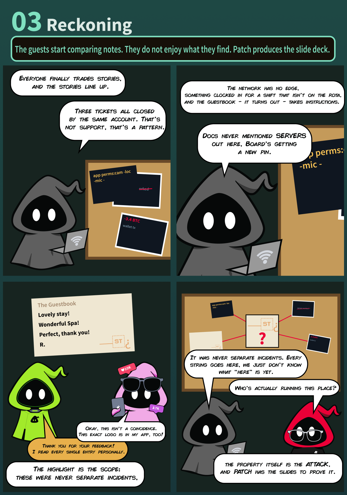
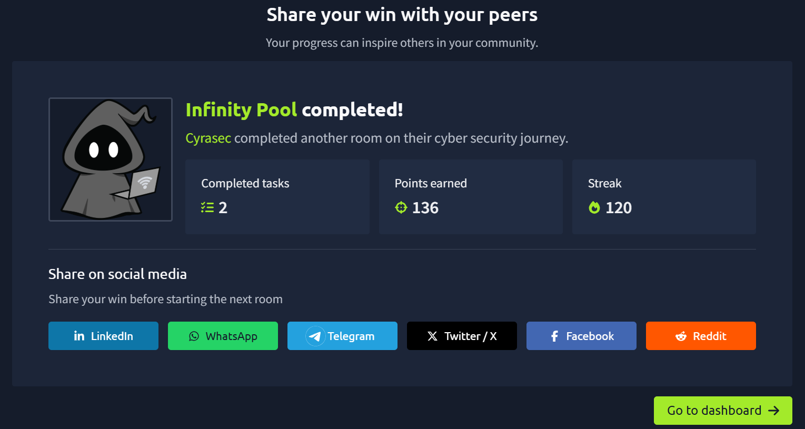

# 🏊 Day 11 — Infinity Pool

> **TryHackMe | Boot2Root | Medium**

---

## 🏁 Completion

| Information | Details |
|---|---|
| 🏨 Room | Infinity Pool |
| 🌐 Category | Boot2Root |
| 📊 Difficulty | Medium |
| 🎯 Objectives | User Flag + Root Flag |
| ✅ Status | Completed |

---

### 🏊 Infinity Pool


### 🎬 Storyline / Reckoning



---

## 🛠️ Tools & Techniques

| Tool / Technique | Purpose |
|---|---|
| 🔎 Nmap | Port and service enumeration |
| 🌐 Web Enumeration | Discover web attack surface |
| 📂 Gobuster | Directory enumeration |
| 🕵️ Burp Suite | HTTP request analysis |
| 🔧 cURL | Manual HTTP requests |
| 🐚 Linux CLI | System enumeration |
| 🔐 Credential Analysis | Investigate authentication-related clues |
| ⬆️ Privilege Escalation | Escalate from user to root |

---

## 📌 Room Overview

**Infinity Pool** is a TryHackMe **Boot2Root** room set in the Byte Lotus Hotel environment.

The objective is to investigate a target system, identify its attack surface, obtain initial access, and ultimately escalate privileges to **root**.

The room contains two main objectives:

- 👤 Find the **User Flag**
- 👑 Find the **Root Flag**

The storyline provides several clues about unusual accounts, exposed services, network activity, and systems that were never intended to be visible to hotel guests.

---

## 🎯 Objectives

- Perform reconnaissance against the target machine.
- Identify exposed ports and services.
- Investigate the web application and available attack surface.
- Analyze the clues provided by the storyline.
- Obtain initial access to the target.
- Enumerate the compromised system.
- Find the user flag.
- Identify a privilege-escalation path.
- Escalate privileges to root.
- Retrieve the root flag.


## 🔍 Reconnaissance

The first step was to identify the services exposed by the target machine.

### Full Port Scan

```bash
nmap -p- -Pn MACHINE_IP
```

### Service & Version Detection

```bash
nmap -sC -sV -Pn MACHINE_IP
```

After identifying interesting ports, targeted enumeration can be performed:

```bash
nmap -sC -sV -p <PORTS> MACHINE_IP
```

This helps identify:

- Open ports
- Running services
- Service versions
- Default configurations
- Potential attack surfaces

---

## 🌐 Web Enumeration

If HTTP/HTTPS services are exposed, the web application should be inspected manually before moving to automated enumeration.

### HTTP Headers

```bash
curl -I http://MACHINE_IP
```

### Page Source

```bash
curl -s http://MACHINE_IP
```

### Directory Enumeration

```bash
gobuster dir \
-u http://MACHINE_IP \
-w /usr/share/wordlists/dirb/common.txt
```

The objective is to identify:

- Hidden directories
- Administrative interfaces
- Exposed files
- Unusual endpoints
- Application functionality
- Potential entry points

---

## 🧩 Storyline Clues

The **Reckoning** section provides several important clues about the environment.

The clues point toward:

- Multiple incidents being connected to the **same account**.
- Unusual network communication occurring outside the expected environment.
- Documentation that did not account for certain systems.
- Application permissions involving sensitive resources.
- A recurring identity/logo appearing across different systems.
- Previously unrelated incidents forming part of a larger pattern.

These clues demonstrate an important security principle:

> **Individual events may appear harmless, but combining them can reveal the bigger attack path.**

---

## 🧭 Methodology

```text
Target Discovery
       ↓
Port & Service Enumeration
       ↓
Web/Application Enumeration
       ↓
Analyze Storyline Clues
       ↓
Identify Attack Surface
       ↓
Obtain Initial Access
       ↓
Enumerate User Environment
       ↓
Find User Flag
       ↓
Privilege Escalation Enumeration
       ↓
Obtain Root Access
       ↓
Find Root Flag
```

---

## 👤 User Enumeration

After obtaining initial access, the first step is to identify the current user and understand the environment.

```bash
whoami
```

```bash
id
```

```bash
pwd
```

```bash
ls -la
```

Additional enumeration can include:

```bash
cat /etc/passwd
```

```bash
hostname
```

```bash
uname -a
```

The user's home directory and accessible files should be inspected for:

- Credentials
- Configuration files
- Scripts
- Sensitive information
- Interesting permissions
- Other potential escalation paths

---

## 👑 Privilege Escalation

After obtaining user-level access, the next objective is to identify a path to root.

### Check Sudo Permissions

```bash
sudo -l
```

### Find SUID Binaries

```bash
find / -perm -4000 -type f 2>/dev/null
```

### Find Writable Files

```bash
find / -writable -type f 2>/dev/null
```

### Check Scheduled Tasks

```bash
cat /etc/crontab
```

### Check Running Processes

```bash
ps aux
```

### Check Network Connections

```bash
ss -tulpn
```

These checks help identify:

- Misconfigured sudo permissions
- SUID binaries
- Writable scripts
- Cron jobs
- Running services
- Exposed credentials
- Privileged processes

---

## 🧠 Key Security Concepts

### 1. Attack Surface Enumeration

A target may expose more services than expected. A complete port scan helps avoid missing less obvious entry points.

### 2. Information Disclosure

Application data, logs, documentation, permissions, and other seemingly harmless information can reveal valuable details about the underlying infrastructure.

### 3. Account & Credential Reuse

Repeated incidents involving the same account can indicate weak credential management or account reuse.

### 4. Service Misconfiguration

Unintentionally exposed or improperly configured services can provide opportunities for initial access or privilege escalation.

### 5. Linux Privilege Escalation

Once a low-privileged shell is obtained, systematic enumeration of:

- `sudo`
- SUID binaries
- Cron jobs
- Writable files
- Services
- Credentials
- Environment variables

can reveal possible paths to root.

---

## 💡 Lessons Learned

- Always perform a complete port scan instead of checking only common ports.
- Enumerate services based on both their versions and functionality.
- Do not ignore clues that initially appear unrelated.
- Information gathered from multiple sources can reveal a larger attack chain.
- Always enumerate the system after obtaining initial access.
- Check permissions before attempting complicated privilege-escalation techniques.
- Separate the attack into clear stages: **Recon → Initial Access → Enumeration → Privilege Escalation**.
- Document findings during the assessment because small clues can become important later.

---

## 🖼️ Room Evidence

### 🏆 Completion



---

## 📚 Skills Practiced

- Network Reconnaissance
- Port Scanning
- Service Enumeration
- Web Enumeration
- Linux Enumeration
- Credential Analysis
- Initial Access
- Privilege Escalation
- System Analysis
- CTF Methodology

---

## ⚠️ Disclaimer

This write-up documents my learning experience while completing an authorized TryHackMe lab.

All testing was performed against the intentionally vulnerable TryHackMe environment.
