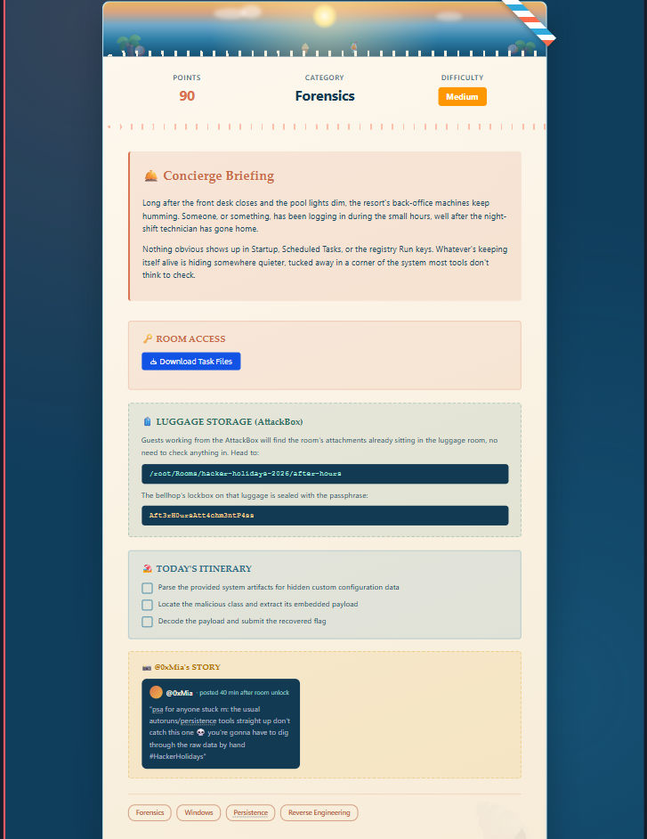
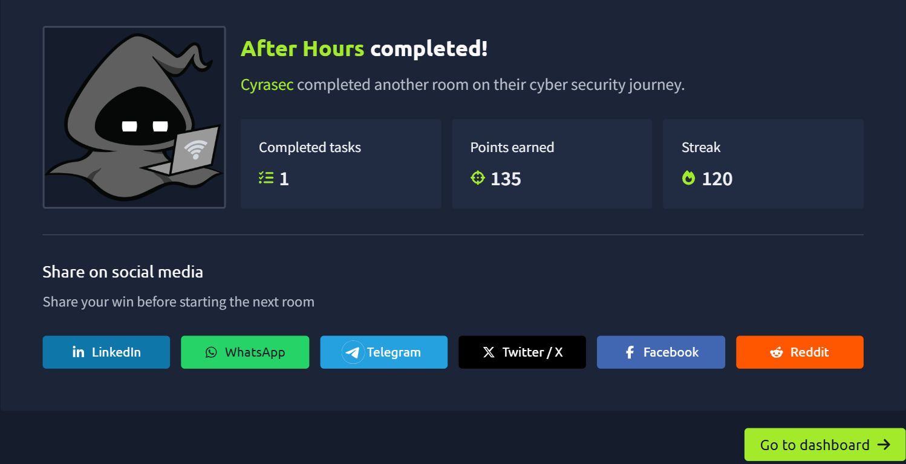

# 🌙 Day 12 — After Hours

> **TryHackMe | Forensics | Medium**

---

### 🧪 Room Task



---

## 🏁 Completion

| Category | Details |
|---|---|
| 🔎 Room | After Hours |
| 🛡️ Category | Forensics |
| 📊 Difficulty | Medium |
| 🖥️ Platform | Windows |
| ✅ Status | Completed |

---

## 📌 Overview

**After Hours** is a Windows Forensics room focused on identifying a hidden persistence mechanism and analysing an embedded malicious payload.

The challenge involves investigating provided system artifacts, locating suspicious configuration data, extracting the payload, and decoding it to recover the flag.

---

## 🛠️ Tools & Techniques

- Windows Forensics
- Registry Analysis
- Persistence Analysis
- Artifact Analysis
- Reverse Engineering
- Payload Extraction & Decoding
- Linux CLI

---

## 🔍 Investigation

The investigation involved:

```text
Analyze Artifacts
      ↓
Find Hidden Configuration
      ↓
Locate Malicious Class
      ↓
Extract Embedded Payload
      ↓
Decode Payload
      ↓
Recover Flag
```

Common persistence locations such as **Startup**, **Scheduled Tasks**, and **Registry Run Keys** were considered during the investigation.

---

## 🧠 Key Takeaways

- Persistence can be hidden outside common startup locations.
- Windows artifacts can reveal valuable forensic evidence.
- Embedded payloads may require extraction and decoding.
- Systematic artifact analysis is essential during forensic investigations.

---

## 🖼️ Evidence



---

**Skills:** Windows Forensics · Persistence Detection · Artifact Analysis · Reverse Engineering
