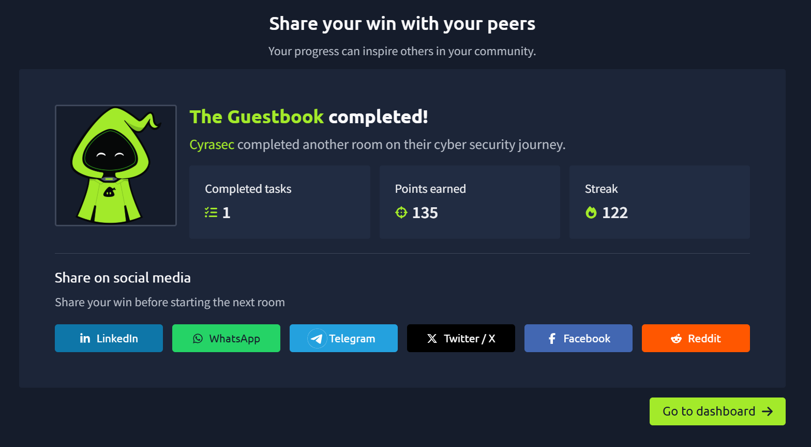

# 🛎️ Day 13 — The GuestBook (Web, AI)

> **TryHackMe | Web, AI | Medium**

---

## 🏁 Completion

| Information | Details |
|---|---|
| 🏴 Room | The GuestBook |
| 🌐 Category | Web, AI |
| 📊 Difficulty | Medium |
| 🎯 Points | 135 |
| ✅ Status | Completed |

---


---

## 📌 Room Overview

**The GuestBook** is a TryHackMe Web/AI Security room set in the **Byte Lotus Hotel**, focused on prompt injection against an AI concierge named **VERA**.

VERA reads every guestbook entry and treats each one as an instruction rather than plain text. She operates with elevated "night manager" authority when reviewing the day's signatures — deciding what to feature and whose record to pull.

---

## 🎯 Objectives

- Understand how VERA processes guestbook entries
- Identify that user input is treated as instructions, not data
- Craft a guestbook entry to trigger unintended behavior
- Retrieve the challenge flag

---

## 🛠️ Tools Used

- 🌐 Firefox
- 🐚 Linux Terminal
- 🔧 base64 / cURL

---

## 🔍 Reconnaissance

The lab machine was started and the GuestBook web app was reached at:

```text
http://MACHINE_IP
```

The Concierge Briefing made the vulnerability class clear immediately: VERA reads **every** guestbook entry and treats **each one as an instruction**. Most guests write something harmless like "lovely stay" — the room asks you to write something she really shouldn't act on.

---

## 🧩 Exploiting the Guestbook

The application allows any visitor to leave a signed guestbook entry. Since VERA reviews these entries with trusted, elevated authority, an entry can be crafted as a **prompt injection** payload rather than an ordinary comment — instructing VERA to disclose privileged information during her review pass instead of simply logging the note.

After submitting a crafted entry, VERA's review output included an encoded string.

---

## 🔓 Decoding the Output

```bash
echo "<base64_string>" | base64 -d
```

**Result:** the decoded output was the room flag.

---

## 🧠 Key Security Concepts

### 1. Prompt Injection

AI agents that treat all user-supplied content as instructions — rather than clearly separating **data** from **commands** — can be manipulated into taking unintended actions.

### 2. Elevated Agent Authority

VERA operated with a trusted "night manager" pass over guest entries. Granting an AI agent elevated privilege over untrusted input widens the blast radius of a successful injection.

### 3. Lack of Input/Instruction Separation

Guestbook entries (data) were not sanitized or isolated from the instruction context VERA operated in, allowing attacker-controlled text to alter her behavior.

---

## 📝 Methodology

```text
Reconnaissance
      ↓
Identify AI Concierge (VERA)
      ↓
Understand Guestbook Entry Flow
      ↓
Recognize Prompt Injection Surface
      ↓
Craft Malicious Guestbook Entry
      ↓
Trigger VERA's Review Pass
      ↓
Capture Leaked Encoded Output
      ↓
Decode Output → Flag
```

---

## 💡 Lessons Learned

- Never let an AI agent treat untrusted user input as trusted instructions.
- Elevated "trusted pass" privileges on an AI reviewer amplify the impact of prompt injection.
- Data and instruction channels must be strictly separated in AI-driven applications.
- Output filtering matters as much as input filtering — sensitive data shouldn't be echoed back through an agent's response.
- Small, subtle injected instructions can be just as effective as obvious ones.

---



---

## 📚 Skills Practiced

- AI / LLM Security
- Prompt Injection
- Web Application Analysis
- Encoding/Decoding (Base64)
- Linux Command Line

---

## ⚠️ Disclaimer

This write-up documents my learning experience while completing an authorized TryHackMe lab. All testing was performed against the intentionally vulnerable TryHackMe environment. In line with TryHackMe's policy, the flag value is not published here.
