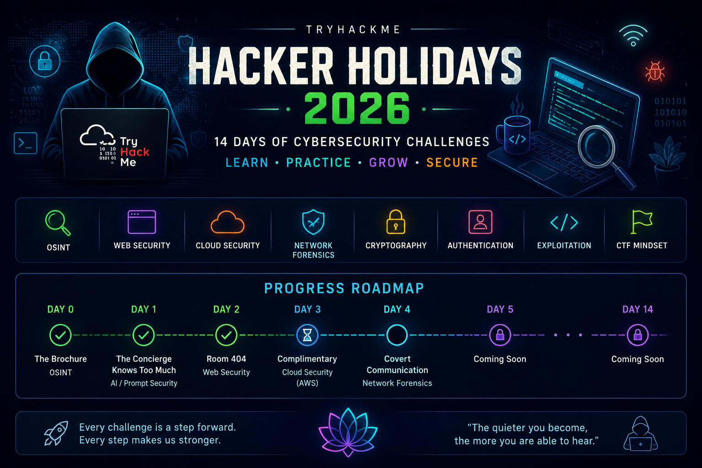

<p align="center">
  
</p>

# 🎯 Hacker Holidays 2026

> My cybersecurity learning journey through the **TryHackMe Hacker Holidays 2026** event.

<p align="center">
  <b>🏝️ 14 Days · 14 Rooms · 100% Completed 🏆</b>
</p>


---

## 📌 About

This repository documents my complete journey through the **TryHackMe Hacker Holidays 2026 — The Byte Lotus** event.

What started as a 14-day cybersecurity challenge became a hands-on learning journey across multiple security domains, including:

* 🔎 OSINT & Reconnaissance
* 🌐 Web Security
* ☁️ Cloud Security
* 🔐 IAM & Authentication
* 🤖 AI & Prompt Security
* 🕵️ Digital Forensics
* 📡 Network & PCAP Analysis
* 🔑 Cryptography
* 💻 Linux Security
* ⬆️ Privilege Escalation
* 🎯 Boot2Root Challenges
* 🧪 Practical Security Investigation

This repository intentionally avoids publishing active challenge solutions or flags.

---

## 🏆 Completion

<p align="center">

### 🏝️ 14 / 14 ROOMS COMPLETED

**Hacker Holidays 2026 — The Byte Lotus**

</p>

> *"Checked in to the Byte Lotus in the summer of 2026, checked out 14 days later, and rooted every room in between."*

📜 **Certificate of Completion:** Earned
📅 **Completed:** August 2026
🏆 **Status:** `100% Completed`

---

## 📅 Complete Progress

| Day    | Room                         | Category               | Status |
| ------ | ---------------------------- | ---------------------- | ------ |
| Day 0  | The Brochure                 | OSINT                  | ✅      |
| Day 1  | The Concierge Knows Too Much | AI / Prompt Security   | ✅      |
| Day 2  | Room 404                     | Web Security           | ✅      |
| Day 3  | Complimentary                | Cloud Security         | ✅      |
| Day 4  | Packed Light                 | Digital Forensics      | ✅      |
| Day 5  | Beach Bar                    | Boot2Root              | ✅      |
| Day 6  | Overheard at Breakfast       | OSINT                  | ✅      |
| Day 7  | Do Not Disturb               | Boot2Root              | ✅      |
| Day 8  | Towel on the Sunbed          | Security Investigation | ✅      |
| Day 9  | CryptoCabana                 | Cryptography / Cloud   | ✅      |
| Day 10 | The Hollow Shell             | Web Security           | ✅      |
| Day 11 | Infinity Pool                | Boot2Root              | ✅      |
| Day 12 | After Hours                  | Digital Forensics      | ✅      |
| Day 13 | The Guestbook                | Web / AI Security      | ✅      |
| Day 14 | Management Wants a Word      | Digital Forensics      | ✅      |

**Progress: `14/14` ✅**

---

## 🛠 Skills Practiced

### 🔎 Reconnaissance & OSINT

* Open Source Intelligence (OSINT)
* Web Enumeration
* Information Gathering
* Git Repository Exposure
* Reconnaissance Techniques

### 🌐 Web & API Security

* Web Application Enumeration
* Browser Developer Tools
* Manual HTTP Requests
* API Security
* Authentication Testing
* Secure Coding Concepts
* YAML Deserialization
* Remote Code Execution (RCE)

### ☁️ Cloud Security

* AWS Concepts
* AWS Cognito
* IAM Concepts
* Cloud Security Investigation
* Access Control

### 🕵️ Digital Forensics

* Network Forensics
* PCAP Analysis
* Log Investigation
* Artifact Analysis
* Evidence-Based Investigation

### 🐧 Linux & Privilege Escalation

* Linux Enumeration
* Linux Command Line
* Shell Stabilization
* Credential Discovery
* Credential Reuse
* File & Permission Analysis
* Privilege Escalation
* Boot2Root Methodology

### 🤖 AI Security

* Prompt Injection
* Memory Poisoning
* AI Security Concepts
* LLM Attack Surfaces

### 🔐 Cryptography & Networking

* Cryptographic Concepts
* Encoding / Decoding
* Network Scanning
* Service Enumeration
* Network Investigation

---

## 🧰 Tools Used

* TryHackMe
* Kali Linux
* Nmap
* Burp Suite
* Gobuster
* Netcat
* curl
* wget
* Git
* Firefox
* Browser Developer Tools
* CyberChef
* Linux Terminal
* Python

---

## 🧠 Key Takeaways

The challenge helped me move beyond simply learning cybersecurity concepts and focus more on **hands-on investigation and problem solving**.

Throughout the rooms, I practiced the complete security workflow:

```text
Reconnaissance
       ↓
Enumeration
       ↓
Identify Weakness
       ↓
Initial Access
       ↓
Investigation / Exploitation
       ↓
Privilege Escalation
       ↓
Objective / Root
```

Each room introduced a different challenge and required a different approach.

The biggest takeaway was learning to **investigate first, understand the environment, and then choose the right technique** rather than relying on a single tool or methodology.

---

## 📚 What This Journey Strengthened

* Practical cybersecurity fundamentals
* Linux and Windows investigation
* Web security methodology
* Cloud security concepts
* Digital forensics
* Network analysis
* OSINT
* AI security awareness
* Privilege escalation methodology
* CTF problem solving
* Security research mindset

---

## 📜 Certificate

Successfully earned the **TryHackMe Hacker Holidays 2026 Certificate of Completion** after completing the full challenge journey.

🏝️ **The Byte Lotus**

**14 Days · 14 Rooms · 100% Completed**

---

## ⚠ Disclaimer

This repository is intended for **educational purposes only**.

To respect the event and the cybersecurity community, **active challenge solutions, flags, credentials, and detailed walkthroughs are intentionally omitted.**

The repository focuses on documenting my **learning journey, skills, tools, and key takeaways**.

---

## 🚀 What's Next?

Hacker Holidays strengthened my practical cybersecurity foundation.

I'm continuing to build hands-on experience in:

* 🛡️ SOC & SIEM
* 🔎 Threat Detection
* 🌐 Web Application Security
* 🕵️ Digital Forensics
* 📡 Network Security
* 🤖 AI Security
* 🧪 CTFs & Security Labs

---

<p align="center">
  <b>🏝️ Checked in. Investigated. Exploited. Rooted. Checked out. 🔐</b>
</p>

<p align="center">
  <b>The holiday is over. The hacking isn't. 🔥</b>
</p>

---

⭐ **Thanks to TryHackMe for Hacker Holidays 2026 and The Byte Lotus experience.**

Happy Learning! 🚀
